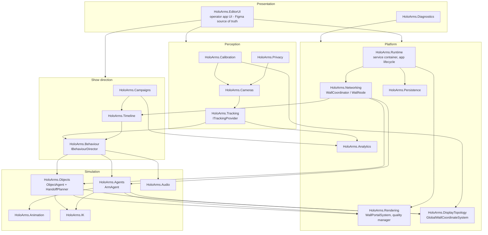

# Module / Component Architecture

> Milestone 0 deliverable 2: component & module architecture, runtime/editor
> separation, data model and event model.

## 1. Module map

All modules live under `UnityProject/Assets/HoloArms/*` with assembly
definitions (`.asmdef`) so dependencies are explicit and one-directional.
No monolithic manager; services are resolved through a lightweight service
container (`IServiceRegistry`) and injected via interfaces.



Dependency rule: **Presentation → Direction → Simulation → Platform**;
Perception feeds Direction/Analytics. Platform modules never reference
upward. `HoloArms.Runtime` owns bootstrapping only.

## 2. Key services (interfaces)

| Interface | Module | Responsibility |
|---|---|---|
| `IServiceRegistry` | Runtime | Composition root; explicit registration, no scattered singletons |
| `IWallPortalSystem` | Rendering | Rear-plane clipping, contact shadow, AO, portal styles |
| `IQualityManager` | Rendering | Presets, capability detection, Auto Quality Controller |
| `IDisplayTopologyService` | DisplayTopology | Topology mode, node registry, global↔local coordinate transforms |
| `IArmRegistry` | Agents | Dynamic add/remove of ArmAgents, neighbour graph, reach volumes |
| `IObjectRegistry` | Objects | ObjectAgents, ownership, grip metadata |
| `IHandoffPlanner` | Objects | Reach-overlap routing graph, handoff choreography |
| `IBehaviourDirector` | Behaviour | `RuleBasedBehaviourDirector` (v1), `AIBehaviourDirector` (future, optional) |
| `ITimelineService` | Timeline | Deterministic clips + conditional blocks |
| `ITrackingProvider` | Tracking | Pluggable CV backend; emits `PersonTrack` updates |
| `ICameraService` | Cameras | Device lifecycle, crop/mirror/zones, reconnect |
| `IWallCoordinator` / `IWallNode` | Networking | Authoritative state vs. local render node |
| `ICampaignService` | Campaigns | Scheduling, frequency caps, ContentPackage activation |
| `IAnalyticsService` | Analytics | Aggregate metrics, CSV/JSON export, webhook adapter |
| `IPersistenceService` | Persistence | Versioned JSON config, schema migration |
| `IPrivacyService` | Privacy | Masks, retention policy, TTL deletion, audit log |
| `IDiagnosticsService` | Diagnostics | Health heartbeat, logs, diagnostics bundle |
| `IRenderCompositionMode` | Rendering | Self-contained / TransparentOverlay / SharedGPUSurface |

## 3. Editor / runtime separation

Two operational layers over one codebase:

```text
┌──────────────────────────────────────────────────────────┐
│ Configure/Edit mode                                      │
│  full EditorUI, asset import, topology, calibration,     │
│  campaign authoring, timeline editing                    │
├──────────────────────────────────────────────────────────┤
│ Show/Kiosk mode                                          │
│  minimal/hidden UI, deterministic runtime, remote status │
│  interface, watchdog-friendly, no modal dialogs          │
└──────────────────────────────────────────────────────────┘
```

- `EditorUI` assemblies and heavy panels are **not loaded** in Show mode
  (separate scene set + additive UI scene only in Edit mode).
- Both modes read the same versioned configuration from `Persistence`.
- Mode switch requires no rebuild; kiosk lock can pin Show mode.

## 4. Data model (persistence roots)

All configuration is versioned JSON (`schemaVersion` on every root document);
unknown keys are preserved on round-trip, never silently discarded.
Migration runs oldest→newest on load.

```text
WallConfiguration        wallId, topologyMode, physical size, nodes[]
NodeConfiguration        nodeId, screenId, position/size (m), resolution,
                         orientation, networkAddress, assignedArmIds[]
ArmConfiguration         armId, side, wallAnchor (global m), profiles:
                         model/appearance/shadow/lighting/LOD, reach envelope
ObjectDefinition         objectId, type, source asset, physical size,
                         gripPoints[], hand compat, mass class, flags,
                         campaignId, CTA metadata
CampaignDefinition       campaignId, brand, schedule, assigned nodes/objects,
                         template, trigger rules, caps/cooldowns, approval
TimelineDefinition       tracks[], clips[], conditional blocks
CameraConfiguration      deviceId, name, crop, mirror, orientation, FOV meta,
                         privacy masks, detection/ignore zones, calibration
CalibrationProfile       homography / camera pose per camera; depth illusion
                         values (Look & Depth page)
QualityConfiguration     preset, targetFps, upscaler, render scale bounds,
                         advanced overrides
ExperienceStyleProfile   preset + appearance/motion/sound settings
ContentPackage           campaign + assets + templates + audio + timelines,
                         configVersion, contentHash (see 04_NETWORK_SYNC)
AnalyticsRecord          aggregate counters keyed by campaign/day (no PII)
```

Runtime-only state (never persisted): `PersonTrack`, object ownership,
network tick, active behaviour states.

## 5. Event model

A typed, allocation-conscious event bus per domain; cross-node events are the
same types serialized onto the network layer with a `NetworkTick` timestamp.

```text
Perception   PersonAppeared, PersonUpdated(track), PersonLost,
             DwellThresholdReached, CameraLost, CameraRecovered
Direction    SequenceStarted/Completed/Aborted, CampaignActivated/Ended,
             AttractModeEntered
Simulation   ArmSpawned/Removed, GestureStarted/Ended, EmotionChanged,
             ObjectSpawned/Removed, GripAcquired, HandoffRequested,
             HandoffReserved, HandoffPointAgreed, OwnershipTransferred,
             GripReleased, ThrowStarted, CatchConfirmed
Photo        PhotoPromptShown, ConsentGiven/Rejected/TimedOut,
             PhotoCaptured, PhotoCardSpawned, PhotoDeletedByTTL
Platform     NodeJoined/Lost/Recovered, CoordinatorLost/Recovered,
             AssetSyncStarted/Completed/Failed, QualityChanged(reason),
             ConfigChanged(audit), HealthHeartbeat
```

Rules:

- Events are facts (past tense); commands are separate request objects
  (`RequestHandoff`, `StartSequence`) so the coordinator can arbitrate.
- Every cross-node event carries `sourceNodeId`, `networkTick`, `sequenceId`.
- Analytics and the audit log are pure event subscribers — no domain module
  depends on them.

## 6. Overlay / composition architecture

`IRenderCompositionMode` implementations (spec §3):

| Mode | Output | Notes |
|---|---|---|
| A. Self-contained | Full scene (wall + arms + objects + shadows) | Default; highest consistency |
| B. Transparent overlay | Arms/objects/portal/shadow matte over external signage | Borderless top-most window; premultiplied alpha; shadow layer uses alpha/multiply compositing |
| C. Shared GPU surface | Zero-copy texture exchange (Spout2 or comparable) | Signage integration without pulling signage into our codebase; NDI optional for remote video only, never the latency-critical local path |

## 7. Repository structure

```text
/Docs                     this architecture package
/FigmaHandoff             extracted tokens, component names, screen hierarchy
/UnityProject
  /Assets/HoloArms/Core          (Runtime, Persistence, Diagnostics, Privacy)
  /Assets/HoloArms/Rendering
  /Assets/HoloArms/Agents        (+ Animation, IK, Behaviour)
  /Assets/HoloArms/Objects
  /Assets/HoloArms/Tracking      (+ Cameras, Calibration)
  /Assets/HoloArms/Networking    (+ DisplayTopology)
  /Assets/HoloArms/Campaigns     (+ Timeline, Analytics)
  /Assets/HoloArms/UI            (EditorUI, implements Figma system)
  /Assets/HoloArms/Diagnostics
/Tools                    asset validation, ContentPackage packer
/ContentSamples           sample GLB/PNG campaign assets
/Tests                    playmode/editmode/soak harnesses
/BuildScripts             CI, kiosk build profiles
```
