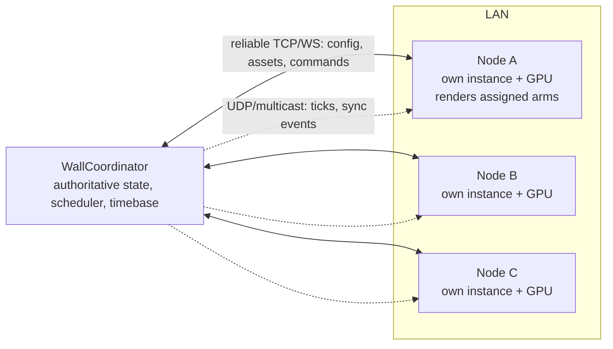

# Display Topology Model

> Milestone 0 deliverable 3: topology diagrams for independent nodes,
> combined canvas, and multi-node global wall. No GPU spanning
> (Mosaic/Eyefinity/Catalyst) is ever required.

## 0. GlobalWallCoordinateSystem

One coordinate system underlies all three modes:

- **Physical metres**: origin at global wall bottom-left, `x` right, `y` up,
  `z` toward the viewer (wall plane at `z = 0`, arm roots at `z < 0`).
- **Normalized wall coords**: `u = x / wallWidthM`, `v = y / wallHeightM`
  for resolution-independent placement.
- Every `ArmAgent`, interaction zone, tracked person and `ObjectAgent` lives
  in global wall coordinates. Nodes derive their local viewport transform
  from `NodeConfiguration` (position, size, resolution, orientation, bezels).

```text
transform chain:  global metres → node-local metres → node viewport pixels
```

## 1. Mode 1 — Independent Node Overlay (default deployment)

Each Holobox/Holowall section runs its own app instance and local GPU render;
nodes synchronize events/world state over LAN.



Node record: `nodeId, screenId, physical position in global wall,
physical width/height, resolution, orientation, network address,
assigned arms/objects/zones`.

## 2. Mode 2 — Existing Combined Canvas

OS/hardware already presents several displays as one large desktop. One app
instance renders one logical canvas split into viewports.

```text
┌────────────────────────── logical canvas 12960 x 3840 ─────────────────────────┐
│ ┌ viewport A ┐  gap  ┌ viewport B ┐  gap  ┌ viewport C ┐                       │
│ │ 2160x3840  │◄────►│ 2160x3840  │◄────►│ 2160x3840  │   bezel/gap            │
│ │ portrait   │      │ portrait   │      │ portrait   │   compensation         │
│ └────────────┘      └────────────┘      └────────────┘   per panel            │
└────────────────────────────────────────────────────────────────────────────────┘
        one app instance, one GPU output, per-panel orientation supported
```

Settings: total logical resolution, screen regions/viewports, bezel/gap
compensation, physical screen positions, orientation per panel. The app
**detects** this configuration but never requires it.

## 3. Mode 3 — Multi-node Global Wall

Independent displays behave as one conceptual wall with no OS/GPU combining.

```text
Global wall: 8.0 m wide x 2.2 m high   (example)

x(m): 0.0      1.35 1.45     2.80 2.90     4.25  ...              8.0
      ├─Node A──┤gap├─Node B──┤gap├─Node C──┤ ...
      │ renders │    │ renders │    │ renders │
      │ x∈[0.0, │    │x∈[1.45, │    │x∈[2.90, │
      │  1.35]  │    │  2.80]  │    │  4.25]  │

ArmAgent @ x=2.1m  → owned/rendered by Node B
Object travelling A→C → ownership transfers B then C at deterministic ticks
Physical gap crossing → edge handoff / throw / slide / reappear transition
```

- A node renders only entities assigned to or intersecting its viewport
  (intersection test uses the entity's bounds in global metres, so an arm
  reaching across a boundary is rendered by both neighbours consistently).
- Object transfer between nodes goes through synchronized ownership events
  with a deterministic transfer timestamp — never through a physically
  continuous framebuffer (see `04_NETWORK_SYNC.md`).

## 4. Mode selection & first-class resolutions

- Topology mode is chosen in Settings (Displays page), stored in
  `WallConfiguration.topologyMode`.
- 4K portrait (2160×3840) and 4K landscape (3840×2160) are first-class,
  60 FPS target on the reference NVIDIA GPU profile; architecture allows
  AMD/Intel where practical.
