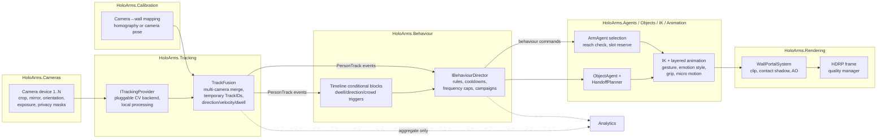

# Data Flow: Camera → Tracker → Behaviour → Arm → Renderer

> Milestone 0 deliverable 4.

## 1. Pipeline diagram



## 2. PersonTrack contract (per detected person)

```text
TrackID                 temporary session ID (no persistent identity)
Source                  camera/screen source
BBox2D                  2D bounding box in camera space
WallPosition            estimated floor position / normalized wall-relative
Direction, Velocity     smoothed walking direction and speed
DwellTime               seconds within current zone
Confidence              provider confidence 0..1
PoseKeypoints?          optional, if provider supports
LastSeen                timestamp (monotonic)
```

Lifecycle: `PersonAppeared → PersonUpdated* → PersonLost` (grace period for
temporary occlusion before Lost). TrackIDs are never persisted; analytics
consumes aggregates only.

## 3. Latency & smoothing budget

| Stage | Budget | Technique |
|---|---|---|
| Capture → detection | ≤ 50 ms | provider-native pipeline, GPU inference where available |
| Fusion + mapping | ≤ 5 ms | precomputed homography, ring buffers |
| Behaviour decision | ≤ 1 frame | rule evaluation on main-thread tick, no allocation |
| IK target update | continuous | critically-damped smoothing; max angular velocity caps so pointing never snaps |
| Direction stability | ~0.5–1.0 s window | hysteresis before "stable direction" triggers (prevents arm oscillation on reversal) |

## 4. Engagement rules (anti-repetitiveness & safety)

- Cooldowns, probability and frequency caps per behaviour and per campaign —
  not every passerby gets an interaction.
- Direction reversal: finish gracefully or re-plan per campaign setting;
  never rapid oscillation.
- Camera loss: `CameraLost` → behaviours degrade to idle/attract mode;
  auto-reconnect issues `CameraRecovered`.
- Privacy: masks applied before detection; detection/ignore zones enforced in
  the fusion stage; see `00_PRODUCT_OVERVIEW.md` privacy pillar.

## 5. Calibration path

Visual wizard (spec §13): pick camera → identify ≥4 reference points →
compute homography (or full camera pose for complex geometry) → live-verify
with an on-wall marker following the tracked person → save per camera.
Multiple cameras may cover one long wall; fusion de-duplicates tracks in
overlap regions by wall-position proximity + velocity match.
