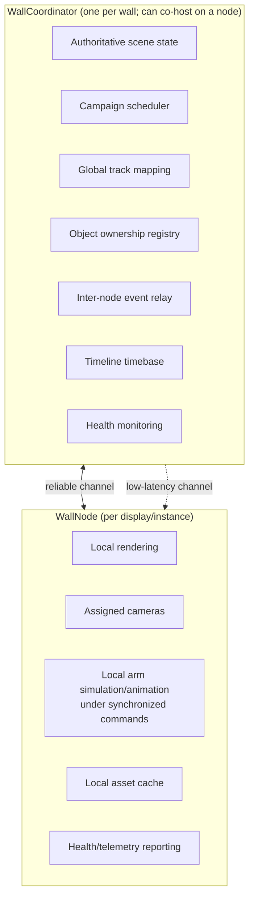

# Network Synchronization Design

> Milestone 0 deliverable 5: WallCoordinator / WallNode architecture,
> transports, time model, asset distribution, failure handling.

## 1. Roles



## 2. Transport split

| Channel | Transport | Carries |
|---|---|---|
| Reliable | WebSocket/TCP | configuration, ContentPackage state, commands, acknowledgements, campaign activation, health |
| Low-latency | UDP / multicast (timestamped events) | NetworkTick, gesture/handoff sync events, timeline cues, audio triggers |
| Time sync | periodic offset/drift correction over reliable channel | clock offset samples |

Design for jitter: low-latency events carry `networkTick + sequenceId`;
receivers schedule execution at `tick + fixedDelay` (interpolation window)
instead of executing on arrival. Late events inside the window still apply;
outside the window they reconcile via the reliable channel.

## 3. Time model

- Monotonic clocks only (`Stopwatch`-class), never wall-clock for sync.
- Shared `NetworkTick` (e.g. 60 Hz logical tick) derived from coordinator
  timebase + measured per-node offset; drift corrected gradually (slew,
  never step, while a show is running).
- PTP/NTP-synchronized hosts are supported for very tight installations but
  never required for normal operation.

## 4. Object ownership & cross-node handoff

Ownership is coordinator-arbitrated; simulation is node-local.

```text
1  sender node   → RequestHandoff(objectId, fromArm, toArm)      [reliable]
2  coordinator   → reserve receiver slot, compute route           (HandoffPlanner)
3  coordinator   → HandoffPlan(sharedPoint, transferTick T)       [reliable]
4  both nodes    → animate approach via IK toward sharedPoint     (local)
5  receiver      → GripConfirmed                                  [low-latency]
6  T reached     → OwnershipTransferred(objectId, newOwnerNode)   [both channels]
7  sender        → release + retract; receiver continues
```

- Object renders on exactly one authoritative owner; during the overlap
  window both nodes render it from the same replicated transform stream so
  there is no visible duplication or disappearance at the boundary.
- Physical gap between displays → configured transition: edge handoff,
  throw, slide, disappear/reappear, or hand entering from next display.

## 5. Asset distribution — ContentPackage

```text
ContentPackage {
  campaign definition, object models/textures, photo frame templates,
  arm appearance references, audio, timeline definitions,
  configVersion, contentHash (sha256 of canonical payload)
}
```

- Coordinator distributes packages (or verifies cache by `contentHash`)
  **before** activating a campaign.
- A synchronized show never starts on a node missing required assets unless
  a configured fallback exists.
- Per-node status surfaced in UI: `Ready / Missing Assets / Syncing / Error`.

## 6. Failure handling

| Failure | Behaviour |
|---|---|
| Coordinator lost | Nodes continue safe idle / current deterministic sequence; never freeze on a broken frame; auto-reconnect with backoff; state reconciliation on rejoin (coordinator snapshot wins, applied at a clean sequence boundary) |
| Node lost | Coordinator reassigns/pauses cross-node sequences involving that node; arms on remaining nodes fall back to local behaviours; `NodeLost` surfaced in health panel |
| Packet delay/jitter | Interpolation window absorbs; reliable channel reconciles |
| Split brain | Single configured coordinator identity; nodes never self-promote; a standby coordinator (future) requires explicit failover config |
| Mid-handoff disconnect | Transfer commits only at tick T with both confirmations; otherwise sender retains ownership and plays a graceful abort (pull-back) |

## 7. Health & telemetry

Heartbeat (1 Hz, reliable channel): FPS, GPU frame time, VRAM, GPU temp/load
where available, camera status, disk space, last successful campaign sync,
network RTT. Rendered in plain language on the Dashboard (spec §28).
