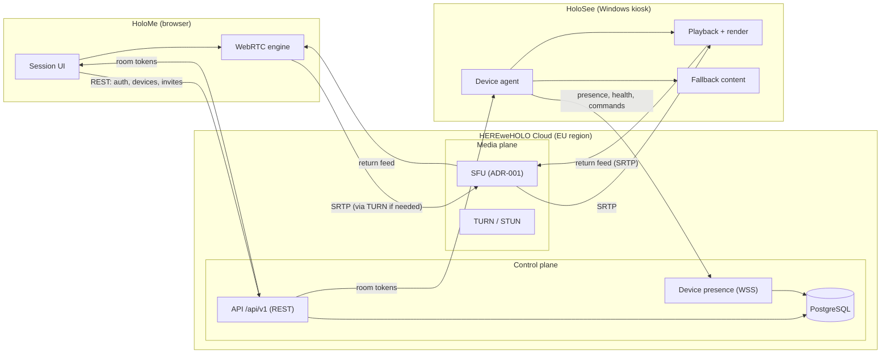

# ARCHITECTURE — HoloMe / HoloSee / HEREweHOLO Cloud

> M0 deliverable. Status: **draft for Desmond's review**. Companion documents:
> [`STREAMING.md`](STREAMING.md) · [`SECURITY.md`](SECURITY.md) · [`DATA-MODEL.md`](DATA-MODEL.md) ·
> [`adr/`](adr/) (one ADR per open technology choice — nothing below is final until those are approved).

## 1. System overview

Three products, two planes:

| Product | Runs on | Role |
|---|---|---|
| **HoloMe** | Browser (MVP), later native mobile | Sender: destination selection, preview, pre-flight, GO LIVE, return feed, effects |
| **HoloSee** | Windows PC driving a Holobox/Holomini/Holowall | Receiver: fullscreen playback, idle/fallback content, pairing, kiosk, watchdog |
| **HEREweHOLO Cloud** | EU cloud region | Control plane (identity, devices, sessions, analytics) + media plane (SFU, TURN) |

The **control plane** decides *who may stream what to where*. The **media plane** moves pixels. They are
separate processes, separately deployable, joined only by short-lived signed tokens: if the control plane
is down, running sessions keep flowing; if the media plane is down, the dashboard still works and says so
honestly.

## 2. Components

### HoloMe (sender)
- Next.js app (decided stack), UI per `design/UI-UX-PLAN.md`.
- Owns: destination selection, network pre-flight, preview, session controls, return-feed inset,
  effects (phase 2), invite creation.
- Talks REST to the control plane; talks WebRTC to the SFU with a room token it received from the
  control plane. Never holds long-lived credentials (see `SECURITY.md`).

### HoloSee (receiver)
Two processes on the kiosk PC, supervised by a watchdog (M5):
- **Device agent** — owns device identity, maintains the presence WebSocket, executes remote commands
  (restart, logs, network test), reports health (CPU/GPU/RAM/temp/uptime), downloads updates (M8).
- **Playback shell** — fullscreen, no chrome; renders the live stream, or fallback brand content the
  instant media stops. Runtime choice is **ADR-002** (it constrains GPU access and zero-copy).
- Crash of either process must not show Windows: the watchdog restarts, fallback covers the gap.

### Control plane (Cloud)
- Versioned REST API (`/api/v1`, OpenAPI) + a persistent WSS channel per online device.
- Owns: organizations, locations, devices, users, roles, sessions, invite links, audit log, health
  time series. PostgreSQL with migrations (`DATA-MODEL.md`).
- Issues all tokens: user sessions, device credentials, guest invite exchanges, SFU room tokens.

### Media plane (Cloud)
- SFU terminates WebRTC from senders and receivers; server choice is **ADR-001**.
- STUN + TURN (TLS on 443 as last resort) for NAT traversal; relay is a first-class, tested path (M2 gate).
- No media logic in the control plane; no business logic in the SFU.

## 3. Key flows

**Pairing (M3)** — HoloSee boots unregistered → generates a device keypair → shows code + QR →
admin confirms in Cloud → control plane binds the public key to the device record → agent receives its
first short-lived device token. No terminal, no config file (acceptance requirement). Details in
`SECURITY.md` §3.

**Session start (M4)** — HoloMe: pick destination(s) → pre-flight probe (via TURN, ~10 s) → verdict →
GO LIVE → control plane creates the session, issues room tokens to sender and each receiver → both join
the SFU room → receiver switches from idle to live the moment the first frame decodes. Target: first
frame on glass < 3 s after GO LIVE.

**Return feed** — the receiver publishes its own camera/mic into the same room; the sender renders it as
the dockable inset. Echo cancellation is mandatory on both legs (`STREAMING.md` §6).

**Degradation** — bandwidth drops: SFU/sender step down the ladder (`STREAMING.md` §4) without ending
the session. Media stops entirely: receiver shows fallback within a defined window (M5 gate), agent keeps
reconnecting silently, dashboard marks the session degraded — with real numbers, never invented ones.

**Telemetry & honesty** — every stage of the chain (capture → encode → transport → decode → render →
physical output) reports its actual resolution/fps into the session record. The UI may only claim what
all stages confirm (project rule 2). One session ID traces end to end through structured logs.

## 4. Process & trust boundaries

| Boundary | Rule |
|---|---|
| Browser ↔ control plane | TLS, short-lived user JWT; no API keys in frontend code |
| Browser ↔ SFU | SRTP; room token scoped to one session, one role |
| Agent ↔ control plane | mTLS-like: signed device token from paired keypair; least-privilege command set |
| Control ↔ media plane | Server-to-server API on a private network; token minting only in control plane |
| Tenant ↔ tenant | `org_id` on every row; isolation enforced at query layer **and tested** (M3 gate) |

## 5. Deployment topology

Start: **one EU region** (ADR-005). All of control plane, PostgreSQL, SFU and TURN co-located;
a second TURN node follows the first non-EU device deployment. Environments: `dev` (docker-compose,
LAN-only for M1), `staging`, `prod`. Everything deploys from CI; the receiver installs from a signed
installer (M8) — never from a dev command on a customer PC.

Scaling path (not built until measurements demand it): SFU nodes are stateless per-room → horizontal
scale + region-aware room placement ("edge route" the UI already shows); PostgreSQL scales up long
before it needs to scale out at fleet sizes in the hundreds.

## 6. What this document deliberately does not decide

SFU product, receiver runtime, encoder abstraction, signaling/control transport details, hosting
provider — each has an ADR in [`adr/`](adr/) with two rejected alternatives, awaiting Desmond's sign-off
(M0 gate). Until then, nothing in this file licenses writing application code.
