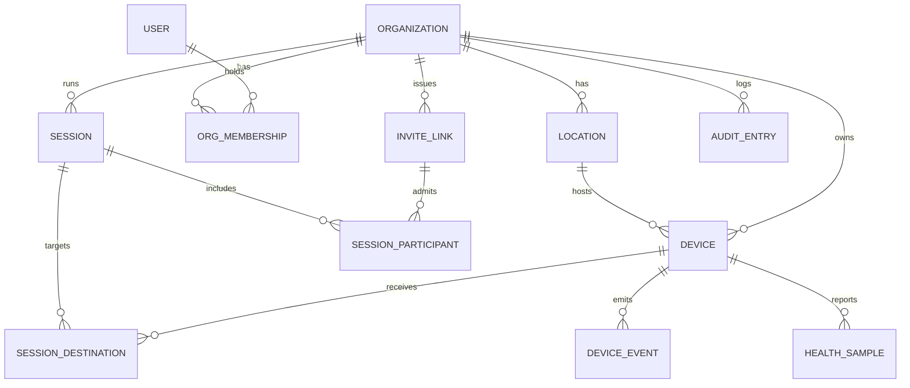

# DATA-MODEL — entities, relations, migrations

> M0 deliverable. Status: **draft for Desmond's review**. Database is decided (PostgreSQL with
> migrations, per `CLAUDE.md`); this document proposes the schema shape and migration strategy.

## 1. Entity overview

## 2. Entities (key fields only)

Every tenant-owned row carries `org_id`; see isolation rules below. All IDs are UUIDv7 (time-ordered,
index-friendly). All timestamps UTC.

| Entity | Key fields | Notes |
|---|---|---|
| `organizations` | name, slug, created_at | Tenant root |
| `locations` | org_id, name, timezone, address? | "Amsterdam HQ" |
| `users` | email (unique), password_hash (Argon2id), totp_secret?, display_name | Global identity |
| `org_memberships` | org_id, user_id, role, location_scope[]? | Role per `SECURITY.md` §5 |
| `devices` | org_id, location_id, name, kind (holobox/holomini/holowall), public_key, state (unpaired/online/offline/degraded), agent_version, last_seen_at | Identity = keypair, never a secret string |
| `pairing_codes` | code_hash, device_pubkey, expires_at, used_at? | Single-use, 10 min TTL |
| `sessions` | org_id, presenter (user_id or participant_id), state (preflight/connecting/live/degraded/ended), started_at, ended_at, stats jsonb | `stats`: avg/min bitrate, resolution per chain stage, fps, packet loss, reconnect count, glass-to-glass latency — filled from telemetry, never estimated |
| `session_destinations` | session_id, device_id, joined_at, left_at | Multi-destination from day one |
| `session_participants` | session_id, kind (member/guest), user_id?, invite_link_id?, display_name | Guests exist only here |
| `invite_links` | org_id, token_hash, created_by, destinations[], expires_at, max_uses (1/∞), password_hash?, revoked_at? | Raw token never stored |
| `device_events` | device_id, type (online/offline/crash/fallback_shown/command/update), payload jsonb, at | Append-only, drives alerts |
| `health_samples` | device_id, at, cpu, gpu, ram, vram, disk, temp, net_rtt | High-frequency; see retention |
| `audit_entries` | org_id, actor (user/device/system), action, target, at, meta jsonb | Append-only, no tokens/PII payloads |

Phase-2 tables (content library, playlists, schedules, recordings) are named now, designed later —
they must not leak into the MVP schema.

## 3. Multi-tenancy & integrity rules

- **Isolation twice:** every repository query filters on `org_id`, **and** PostgreSQL row-level
  security enforces the same predicate from the JWT's `org_id`. The M3 gate test creates two orgs and
  proves neither can see the other — through the API *and* through a deliberately buggy query.
- Cross-org references are impossible by construction: composite FKs include `org_id` where a child
  references a tenant-owned parent.
- `sessions.state` transitions are enforced in one place (state machine in the API), mirrored by a
  CHECK constraint on allowed values.

## 4. Telemetry & retention

- `health_samples`: raw at 15 s intervals, kept 48 h; rolled up to 5 min aggregates kept 90 days.
- `sessions.stats` aggregates are written at session end from the media-plane telemetry stream; the
  per-second live values shown in the status strip are transient (not persisted beyond aggregates).
- `device_events` and `audit_entries`: append-only, kept ≥ 1 year (compliance-friendly default,
  revisit with legal).

## 5. Migration strategy

- **SQL-first, forward-only** migrations, one directory, numbered, applied by CI on deploy;
  every migration runs in a transaction and is tested against a copy of staging data.
- Tooling proposal: **Drizzle Kit** (fits the decided TypeScript stack; migrations remain plain SQL
  files in git — no runtime magic). Alternatives if rejected: Atlas, Flyway. This is a tooling detail,
  not an ADR-level decision — the SQL files are the contract.
- Rule for the MVP phase: schema changes land **with** the code that uses them, in the same PR, with
  seed fixtures updated. No destructive migration (DROP/ALTER that loses data) without an explicit
  backup step in the same migration.
- Local dev gets `make db-reset` (drop, migrate, seed) from M3 on; seeds contain the two-org isolation
  fixture used by the gate test.
